# Output


## 1 Dev.to

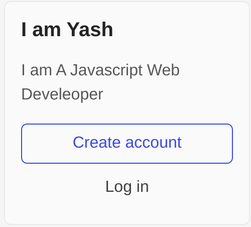

---

## 2 


----


## 3

code 
```
const topic = document.querySelector(".accordion-homepage")

const newSec = document.createElement("section");
newSec.className = "parent"

const heading3 = document.createElement("h3");

heading3.innerText = "My Faq Section";
newSec.appendChild(heading3);
topic.appendChild(newSec);
```

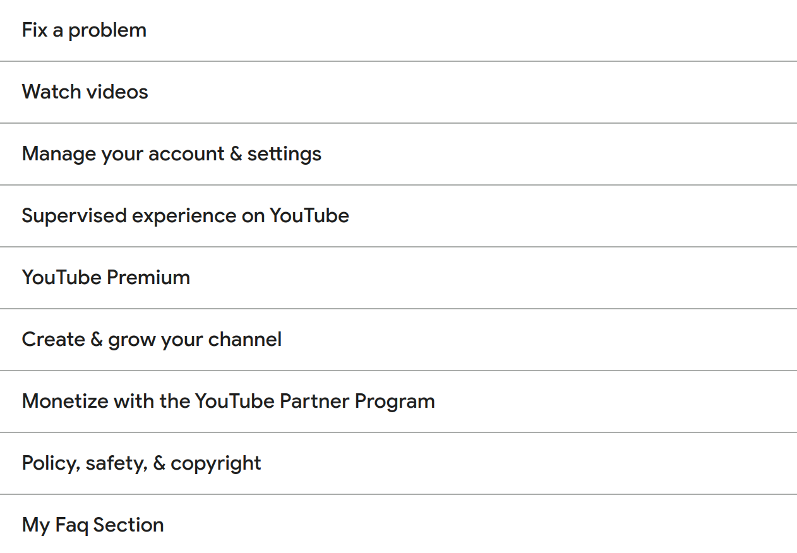


----------

## 4

```
document.querySelector(".one-tel-number.service-number").textContent = +6366256689
```

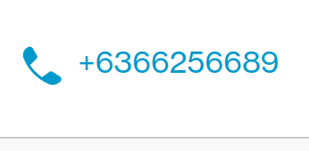


----------

## 5

```
document.querySelectorAll(".diwali-deals-product-sale-btn")[11].innerText = "CheckOut"
'CheckOut'
```
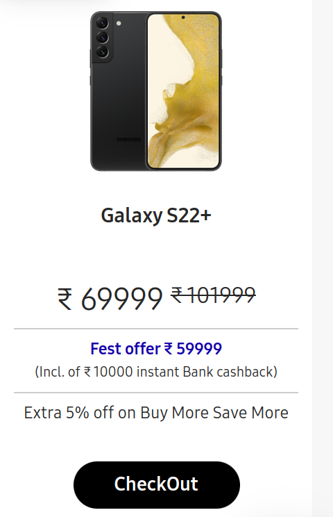


---------

## 6

~~~
function colorRed() {
    document.querySelector(".searchinput___19uW0").style.backgroundColor = "red";
}

document.querySelector(".searchinput___19uW0").addEventListener("mouseover", colorRed() );

~~~


--------
## 7
```
document.querySelector("#top-nav-search-input").value = "CSS Selector" ;
document.getElementById("top-nav-search-form").submit();
```
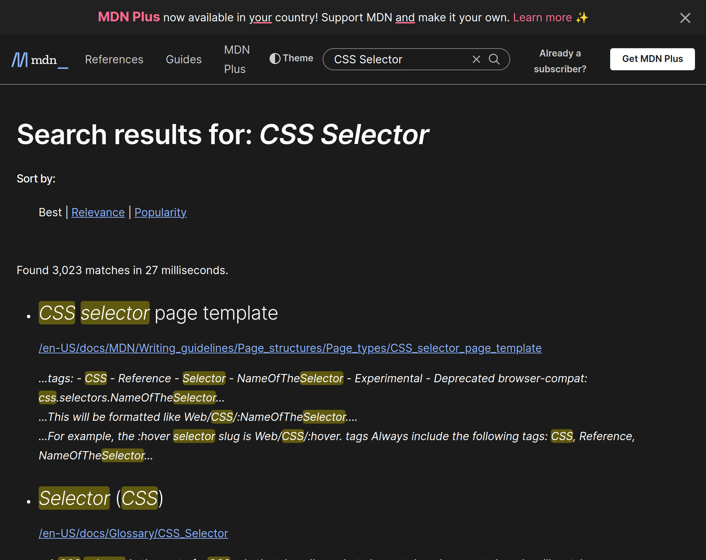


--------

## 8

```
let arr = document.querySelector(".z4hgWe");
arr = [...arr.children]
for (i = 0; i < arr.length; i++) {
  if (i % 2 === 0) {
    arr[i].remove();
  }
}
```

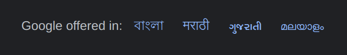

----------

## 9

```
document.querySelector(".display-heading-1").style.color = "red";
document.querySelector(".display-heading-1").style.fontFamily = "serif"
```

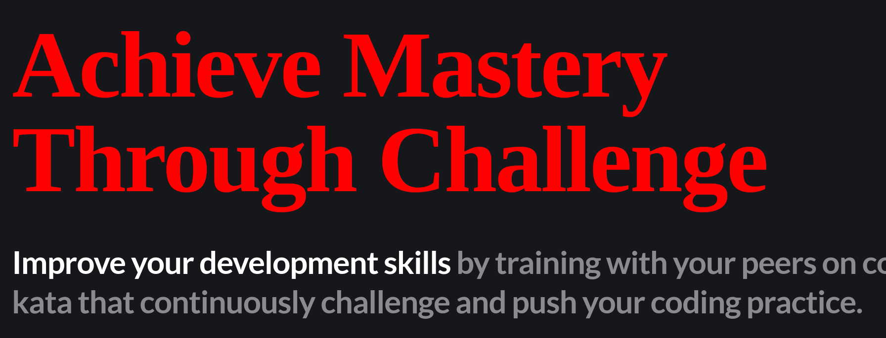


-----------

## 10

```
function changeColor(){
    document.querySelectorAll(".login-btn-text")[1].style.backgroundColor = "red"
}
document.addEventListener("mouseover" , changeColor())
```


## 11

```
document.querySelector(".icon-logo").style.backgroundImage = "url('https://ineuron.ai/images/ineuron-logo.png')";
```

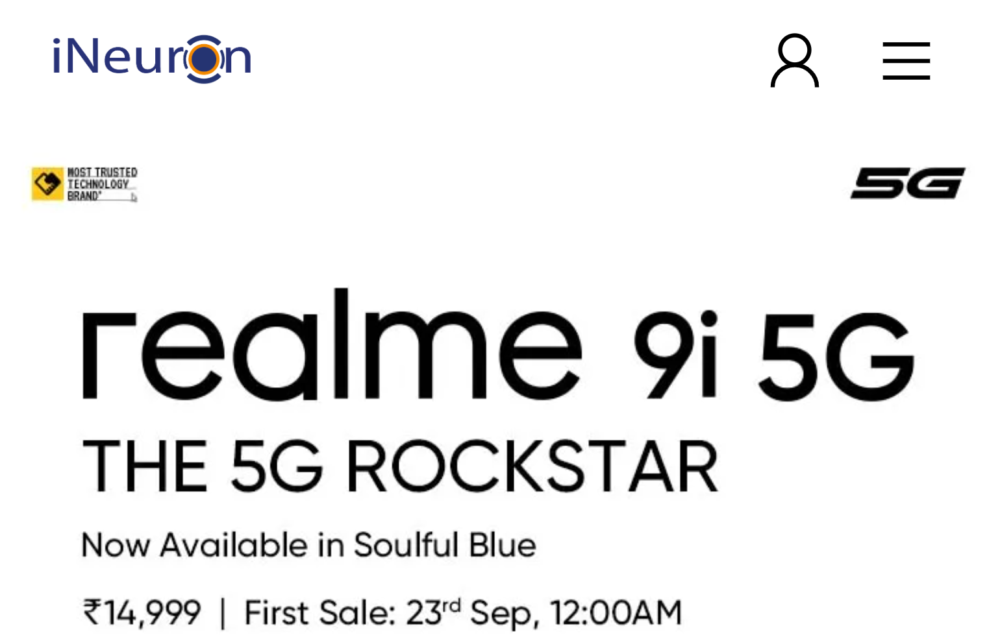


## 12

```
document.querySelector(".text-center.btn.btn-primary.ml-3").style.backgroundColor = "blue"
```
 

------

## 13
```
document.querySelector(".fl-heading-text").innerHTML = "JS Bootcamp";
```
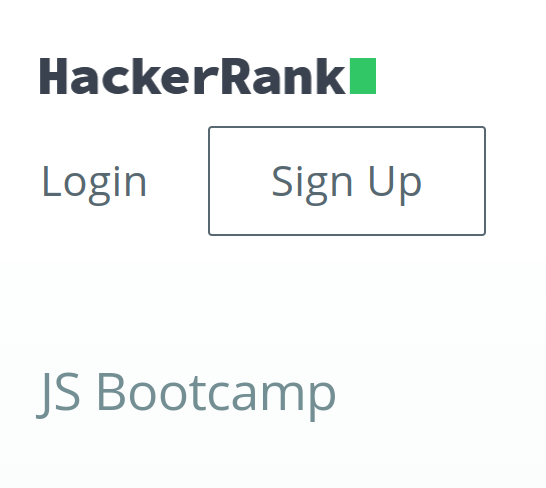 

------
## 14
```
document.querySelector(".HotDealsAll__Heading__2fIbe").style.fontSize = "80px";
```
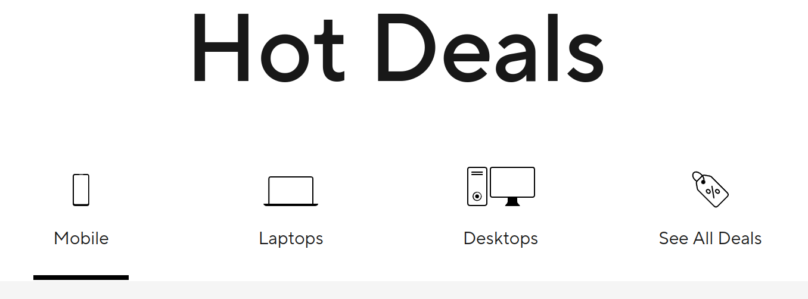 

------
## 15
```
document.querySelectorAll(".ps-title")[4].style.textAlign = "right";
```
 

------
## 16
```
document.querySelector(".section-title_title__VEDfK").innerHTML = 'Start with Scratch'
```
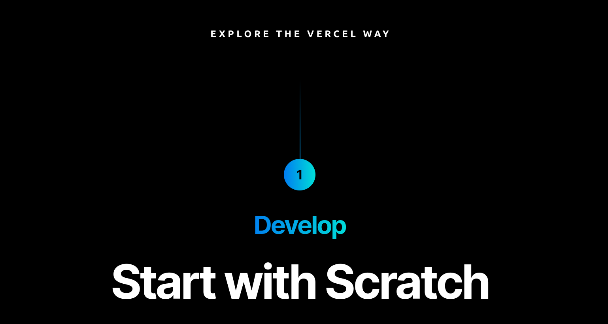 

------
## 17
```
let date = new Date ();
document.querySelector(".btn.btn-large.btn-block.buy.buy-button.retailer_btn-align").innerHTML = date;
```
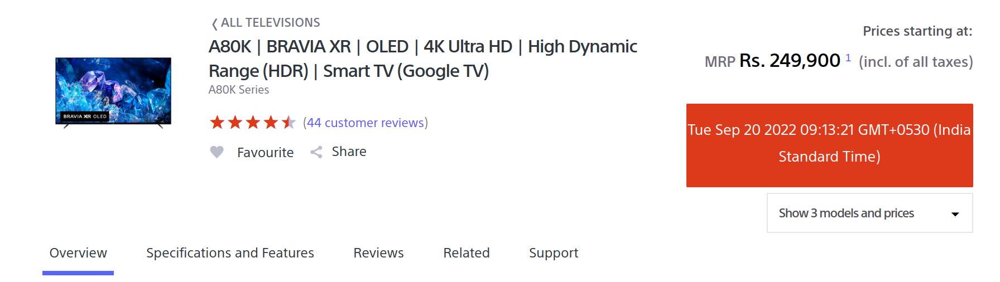 

------
## 18
```
document.querySelector(".p-f03-footer-container").style.background = "orange"
```
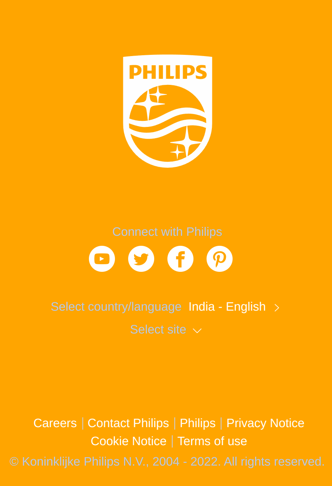 

------
## 19
```
document.querySelector(".logo").src
```
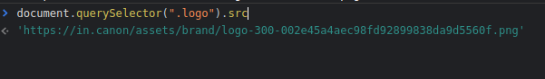 
------
## 20
```
document.querySelector(".section-box .desc").style.color = "orange"
```
 